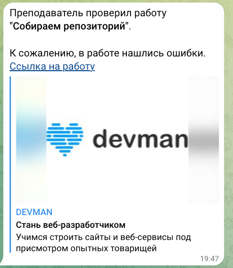

# Notification Bot
This Python script is designed to notify you via a Telegram bot when a review of your work on Devman site has been completed.
It uses Devman's API for long polling to check for new reviews, and if a review is found, it sends you a notification via your Telegram bot.

## Prerequisites
Before you can use this script, you'll need to set up a few things:

**Devman Token**: You'll need an API token from Devman.
You can obtain it by following the instructions here.

**Telegram Bot Token**: You'll also need a Telegram bot token.
You can create a new bot and obtain a token by talking to the [BotFather](https://t.me/BotFather) on Telegram.

**Chat ID**: You'll need the Chat ID of the Telegram chat where you want to receive notifications.
You can get your Chat ID by talking to the [userinfobot](https://web.telegram.org/k/#@userinfobot).

**Python Environment**: Make sure you have Python installed on your system.

## Installation
1. Clone this repository:

```
git clone https://github.com/kashaeva-dev/api-devman.git
```
2. Create virtual environment and activate it:
```bash
python -m venv env
source env/bin/activate
```
The project's functionality has been tested on Python 3.11

3. Install the required Python packages using pip:

```bash
pip install -r requirements.txt
```

4. Configuration

Create a .env file in the project directory and add the following configuration variables:

```
DEVMAN_TOKEN=your_devman_api_token
TG_BOT_TOKEN=your_telegram_bot_token
CHAT_ID=your_telegram_chat_id
```
Replace your_devman_api_token, your_telegram_bot_token, and your_telegram_chat_id with your actual tokens and chat ID.

## Usage
Run the script using Python:

```
python main.py
```
The script will start checking for new reviews on Devman.
When a new review is found, it will send you a Telegram notification.

## Example notification


